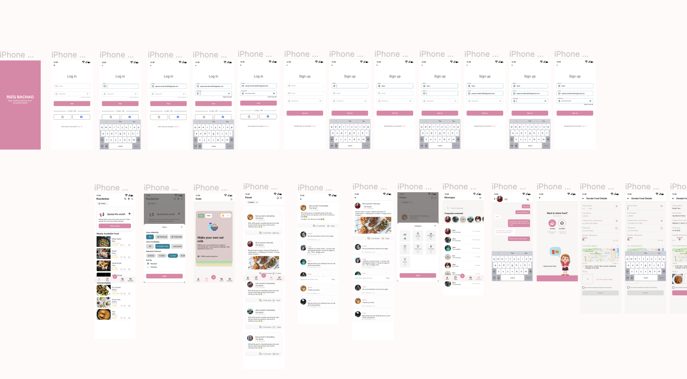

# About Project

# Working Demo

# Flutter Project

This is a Flutter project for creating a mobile application. Flutter is an open-source UI software development kit created by Google. It is used to develop applications for Android, iOS, Linux, Mac, Windows, Google Fuchsia, and the web.

## Requirements

- Flutter SDK
- Android Studio
- Xcode

## Installation

1. Download and install the Flutter SDK from the [Flutter website](https://flutter.dev/). Ensure that you install the latest stable version of the Flutter SDK.

2. Download and install Android Studio from the [Android Studio website](https://developer.android.com/studio). Ensure that you install the latest stable version of Android Studio.

3. Download and install Xcode from the [Apple App Store](https://apps.apple.com/us/app/xcode/id497799835). Ensure that you install the latest stable version of Xcode.

## Usage

1. Open Android Studio and select "Open an existing Android Studio project".

2. Navigate to the directory containing your Flutter project and select the `android` directory.

3. Open Xcode and select "Create a new Xcode project".

4. Navigate to the directory containing your Flutter project and select the `ios` directory.

5. In both Android Studio and Xcode, you can edit the project files to customize the application.

6. When you are finished making changes, you can build the application for each platform by running the `flutter build` command in your terminal.

7. Once you have built the application, you can deploy it to the app store of your choice.

## Troubleshooting

If you encounter any errors while building or deploying the application, you can refer to the [Flutter documentation](https://flutter.dev/docs) or [Stack Overflow](https://stackoverflow.com/) for help.

